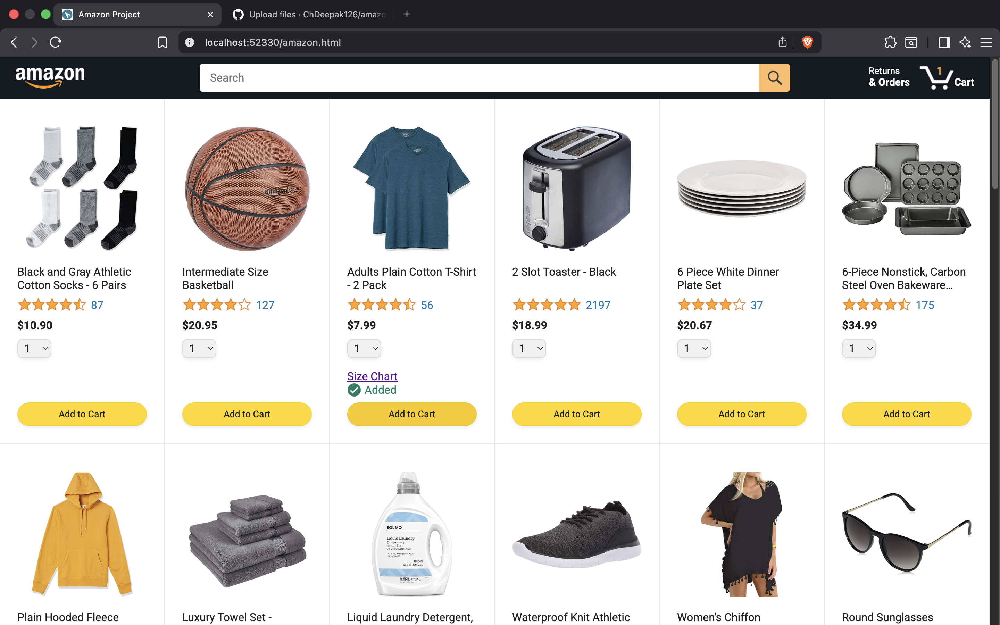
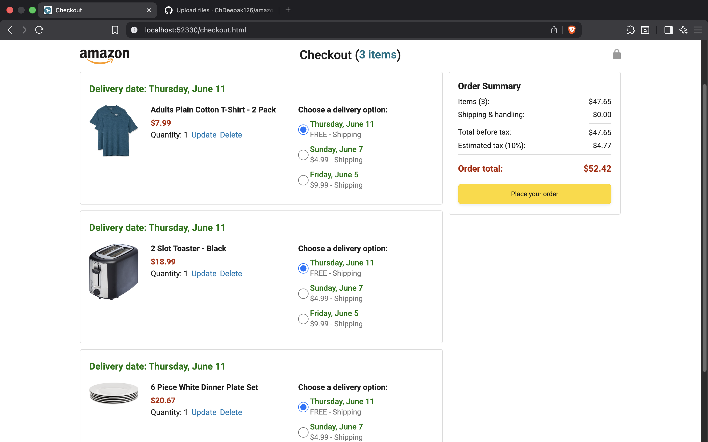
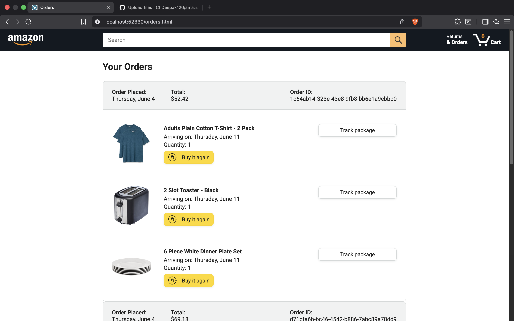
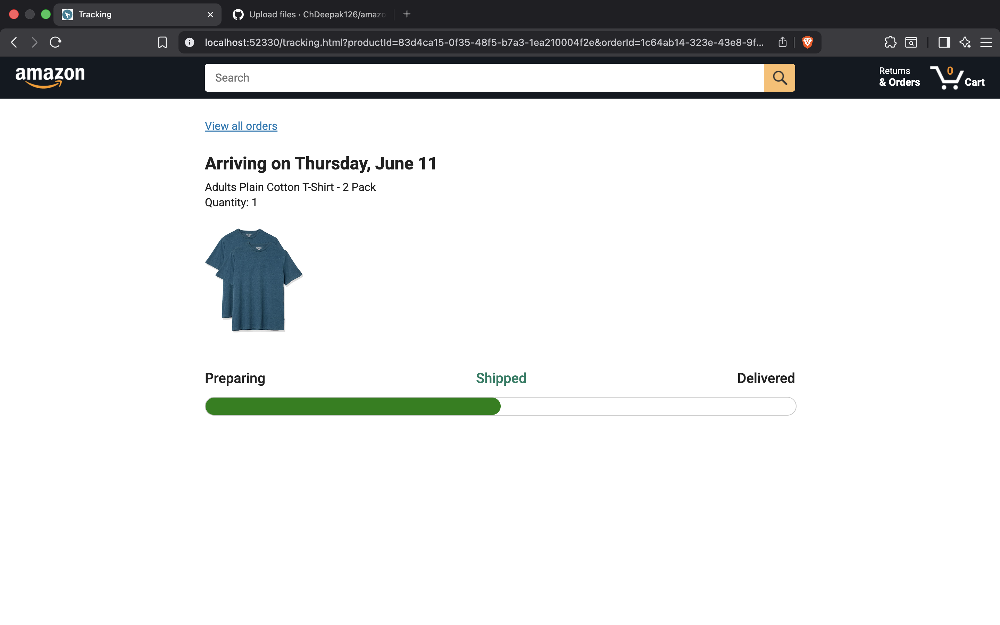

# Amazon Clone

A dynamic e-commerce web application built using HTML, CSS, and JavaScript.

## Overview

This project was built to practice modern JavaScript concepts by developing a complete shopping experience similar to Amazon. The application includes product browsing, cart management, checkout, order history, product tracking, backend integration, and automated testing.

## Features

* Dynamic product rendering
* Add to Cart functionality
* Real-time cart quantity updates
* Interactive "Added to Cart" notifications
* Dynamic checkout calculations
* Multiple delivery options
* Order placement workflow
* Order history page
* Product tracking page
* LocalStorage persistence
* Backend API integration
* Unit testing with Jasmine

## Technologies Used

* HTML5
* CSS3
* JavaScript (ES6+)
* Fetch API
* Async/Await
* LocalStorage
* Day.js
* Jasmine

## Concepts Practiced

* DOM Manipulation
* Object-Oriented Programming (OOP)
* ES6 Modules
* Event Handling
* Template Literals
* Data Attributes (dataset)
* Callbacks
* Promises
* Async/Await
* URLSearchParams
* Debugging and Error Handling
* Unit Testing

## Testing

The project includes automated tests using Jasmine.

Testing concepts covered:

* Unit Testing
* beforeEach()
* beforeAll()
* Mocking LocalStorage
* Test Suites
* Business Logic Validation

## Demo

A screen recording of the project is available in my LinkedIn project post.

## Screenshots

### Home Page

### Checkout Page

### Orders Page

### Tracking Page

## Future Improvements

## Future Improvements

* Quantity update functionality
* Search functionality
* Responsive enhancements
* Additional test coverage

## Acknowledgements

This project was built while following the JavaScript course by SuperSimpleDev and was extended through additional implementation, debugging, testing, and feature development.

